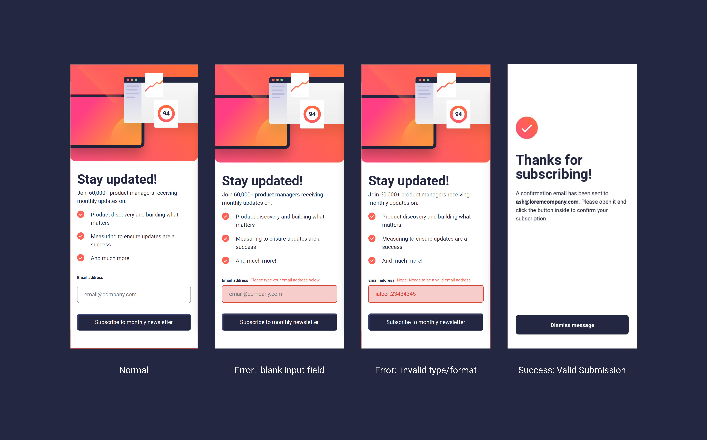

# Frontend Mentor - Newsletter sign-up form with success message solution

This is a solution to the [Newsletter sign-up form with success message challenge on Frontend Mentor](https://www.frontendmentor.io/challenges/newsletter-signup-form-with-success-message-3FC1AZbNrv). Frontend Mentor challenges help you improve your coding skills by building realistic projects.

## Table of contents

- [Overview](#overview)
  - [The challenge](#the-challenge)
  - [Screenshot](#screenshot)
  - [Links](#links)
- [My process](#my-process)
  - [Built with](#built-with)
  - [What I learned](#what-i-learned)
  - [Useful resources](#useful-resources)
- [Author](#author)

## Overview

### The challenge

Users should be able to:

- Add their email and submit the form
- See a success message with their email after successfully submitting the form
- See form validation messages if:
  - The field is left empty
  - The email address is not formatted correctly
- View the optimal layout for the interface depending on their device's screen size
- See hover and focus states for all interactive elements on the page

### Screenshot

### Links

- Solution URL: [Github repo for Newsletter Sign-Up](https://ialbertmartinez.github.io/newsletter-sign-up/)
- Live Site URL: [Newsletter Sign-Up Live Site](https://ialbertmartinez.github.io/newsletter-sign-up/)

## My process

### Built with

- Semantic HTML5 markup
- BEM methodology
- JavaScript:
  - Custom Form validation
- CSS
- HTML Form
- Web Events
- Flexbox
- Media queries
- Mobile-first workflow
- Chrome Developer Tools

### What I learned

This was a fun and challenging project to work on. I recently started using [BEM methodology](https://en.bem.info/methodology/key-concepts/) . This is my fourth small project using it. I see the benefits of it more and more everytime. Initially, I thought this was going to be a nightmare. Well I proved myself wrong. Breaking my site plan down from the start using BEM Blocks, helped me see the big picture right off the bat. once you understand your blocks, the elements fall into place with minimal effort. For instance,
I split my project up into 5 BEM blocks:

- Page: The initial front page
- Form: The form to register with
- Button: The two buttons, 'Submit' and 'Dismiss'
- Success: The success page if user's data passes validation

** fun fact: Each block has its own stylesheet named after itself **

My project file structure is as follows:

Root

- index.html: all the HTML lives
- vendor/normalize.css (css reset)
- pages/index.css: the only css file that gets linked to from the HTML page. Everything else gets '@import'-ed
- blocks/: the css files for the entire project including the js file for the form
- assets/: fonts and images are found here

As I go over my notes I will complete this area of my documentation.
Until then, may we all find the CSS to our HTML

-A

### Useful resources

- [JS Validation API: Constraint Validation DOM Methods ](https://www.w3schools.com/js/js_validation_api.asp) - This is the logic I used to validate my form. Using the validation API, i could check the data submitted by the user and quickly show the error message with my own custom text and styling.

- [JavaScript: HTML Form - Email validation](https://www.w3resource.com/javascript/form/email-validation.php) - Used it to create my first attempt at the form validation but went a different route.

## Author

- Github - [Albert Martinez](https://github.com/ialbertmartinez)
- Frontend Mentor - [@ialbertmartinez](https://www.frontendmentor.io/profile/ialbertmartinez)
- Twitter - [@iAlbertM](https://www.twitter.com/ialbertm)
